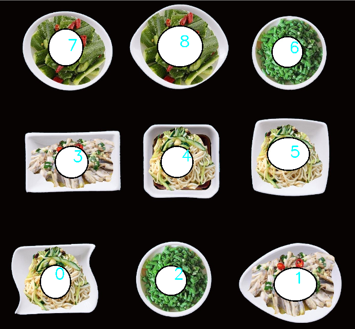
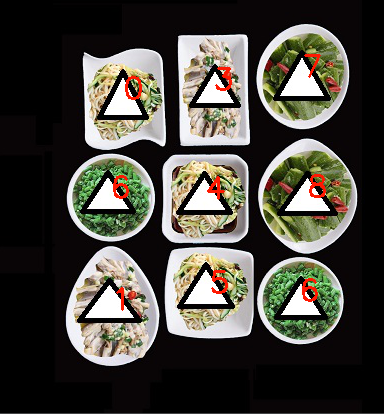

# 一种基于Hu Moments 不变性的多形状餐盘快速匹配算法
Invariant to scaling, rotaiton and translation!

## Dependencies
Python3, OpenCV3.4.1 

## Experiment
### 1.Source image with index number in the center: (1386x1296)
  

### 2.Matching Result for Reference Image (A Similarity Transformation version of Source Image): (389x417)
 
